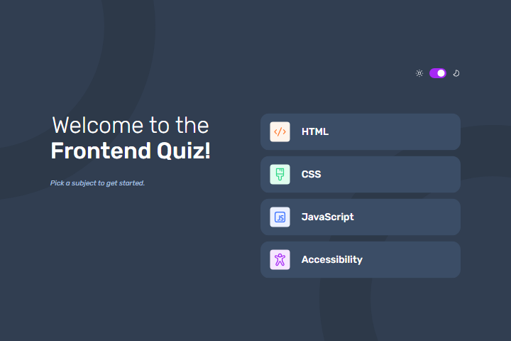

# Frontend Mentor - Frontend quiz app solution

This is a solution to the [Frontend quiz app challenge on Frontend Mentor](https://www.frontendmentor.io/challenges/frontend-quiz-app-BE7xkzXQnU). Frontend Mentor challenges help you improve your coding skills by building realistic projects.

## Table of contents

- [Overview](#overview)
  - [The challenge](#the-challenge)
  - [Screenshot](#screenshot)
  - [Links](#links)
- [My process](#my-process)
  - [Built with](#built-with)
  - [What I learned](#what-i-learned)
  - [Continued development](#continued-development)
  - [Useful resources](#useful-resources)
- [Author](#author)

## Overview

### The challenge

Users should be able to:

- Select a quiz subject
- Select a single answer from each question from a choice of four
- See an error message when trying to submit an answer without making a selection
- See if they have made a correct or incorrect choice when they submit an answer
- Move on to the next question after seeing the question result
- See a completed state with the score after the final question
- Play again to choose another subject
- View the optimal layout for the interface depending on their device's screen size
- See hover and focus states for all interactive elements on the page
- Navigate the entire app only using their keyboard
- **Bonus**: Change the app's theme between light and dark

### Screenshot



### Links

- Solution URL: [GitHub](https://github.com/artemkotko14/frontend-quiz-app)
- Live Site URL: [Webpage](https://artemkotko14.github.io/frontend-quiz-app/)

## My process

### Built with

- Semantic HTML5 markup
- CSS custom properties
- Flexbox
- [React](https://reactjs.org/) - JS library
- TypeScript
- Vite
- SASS

### What I learned

Sliding animation of a switch:

```css
input:checked + .slider::before {
  transform: translateX(20px);
}
```

**aria-label** gives an accessible name to an element, so screen readers can announce what it is. It does not show anything visually — it’s purely for assistive technologies.

```tsx
<input
  type="checkbox"
  checked={colorMode === "dark"}
  onChange={onToggle}
  aria-label="Toggle dark mode"
/>
```

```css
.theme-toggle-wrapper:focus-within {
  border: 2px solid purple;
}
```

That means: if any child inside .theme-toggle-wrapper has focus, the wrapper gets styled.

### Continued development

In future projects I want to practise making React apps using TypeScript.

### Useful resources

- [How to Deploy Vite + React App to GitHub](https://www.youtube.com/watch?v=XQAaAQnw2Mk&ab_channel=TechCoffeeBreak) - Good step by step explanation.

## Author

- Github - [Artem Kotko](https://github.com/artemkotko14)
- Frontend Mentor - [@artemkotko14](https://www.frontendmentor.io/profile/artemkotko14)
